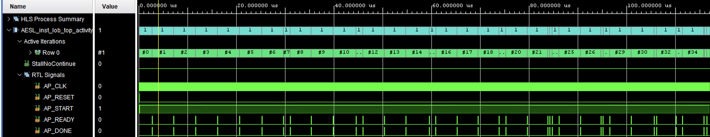

# HLS Limit Order Book

Synthesizable single-instrument limit order book prototype in C++ for Vitis HLS.

This project is intentionally designed as an FPGA/HLS learning artifact, not a production exchange engine. The implementation favors static storage, bounded loops, explicit state transitions, and deterministic behavior over software-centric data structures such as trees, linked lists, hash maps, or heap allocation.

## Why This Project Matters

- Low-latency trading systems often use FPGA acceleration.
- Order book logic is a core component in exchanges and HFT.
- Implementing it under HLS constraints requires different thinking than software.
- This project demonstrates:
  - hardware-aware data structures
  - deterministic processing
  - bounded resource design

## Repository Layout

- `README.md`
- `src/lob.hpp`
- `src/lob.cpp`
- `src/top.cpp`
- `tb/tb_lob.cpp`

## What It Supports

- Separate bid and ask books
- Limit order add
- Matching of aggressive incoming limit orders against the opposite side
- Partial fills
- Price priority across price levels
- Approximate time priority within each price level using a bounded FIFO ring
- Cancel by order ID for resting orders
- Single instrument only

Top-level entry point: [src/top.cpp](/Users/kivanc/GitHub/HLS-Limit-Order-Book/src/top.cpp)

Core model: [src/lob.hpp](/Users/kivanc/GitHub/HLS-Limit-Order-Book/src/lob.hpp), [src/lob.cpp](/Users/kivanc/GitHub/HLS-Limit-Order-Book/src/lob.cpp)

Testbench: [tb/tb_lob.cpp](/Users/kivanc/GitHub/HLS-Limit-Order-Book/tb/tb_lob.cpp)

## Architecture

The book is built from two fixed-size arrays of price levels:

- bids sorted in descending price order
- asks sorted in ascending price order

Each price level stores:

- `price`
- `total_quantity`
- `order_count`
- `head` and `tail` indices
- a fixed-size `orders[MAX_ORDERS_PER_LEVEL]` array

The matching rule is straightforward:

1. An incoming `CMD_ADD` first checks whether it crosses the opposite side.
2. If it crosses, matching starts from the best available opposite price.
3. Inside one level, the queue head is consumed first.
4. If the incoming order is only partially filled, its residual quantity is inserted as a resting limit order on its own side.

Cancel support uses a bounded lookup table:

- `order_lookup[MAX_ORDERS]`
- each active entry stores `{order_id, side, price}`
- cancel first resolves the target side/price via the lookup table
- then it scans the bounded level queue to remove the exact order

This is a deliberate compromise. The lookup avoids a full-book search on every cancel, while still avoiding unstable pointers or dynamic structures that would synthesize poorly.

## Data Structures

Important compile-time limits in [src/lob.hpp](/Users/kivanc/GitHub/HLS-Limit-Order-Book/src/lob.hpp):

- `MAX_ORDERS = 128`
- `MAX_PRICE_LEVELS = 16`
- `MAX_ORDERS_PER_LEVEL = 8`

Main structs:

- `Order`
  Resting order payload held inside a price level queue.
- `PriceLevel`
  One price bucket with aggregate quantity and bounded FIFO storage.
- `OrderLookupEntry`
  Bounded metadata entry used for cancel-by-ID.
- `Command`
  Input event for the top-level kernel.
- `CommandResult`
  Compact output with acceptance status, fill summary, cancel summary, and top-of-book snapshot.
- `LimitOrderBook`
  Entire persistent single-instrument state.

## Supported Operations

### `CMD_RESET`

Clears all resting state.

### `CMD_ADD`

Represents an incoming limit order.

Behavior:

- If non-crossing, it rests in the book.
- If crossing, it matches best-price first on the opposite side.
- If fully filled, no resting order remains.
- If partially filled, the residual quantity rests using the same order ID.

### `CMD_CANCEL`

Cancels a resting order by `order_id`.

Behavior:

- Rejects if the order ID is not currently active in the lookup table.
- Removes quantity from the owning level.
- Deletes the level if the cancelled order was the last order at that price.

## Result Reporting

`CommandResult` intentionally keeps outputs compact and bounded:

- `code`
- `accepted`
- `executed_quantity`
- `cancelled_quantity`
- `remaining_quantity`
- `last_trade_price`
- `trade_count`
- touched level fields
- best bid / best ask summary

This is intentionally more hardware-friendly than emitting a variable-length list of fill events.

## Hardware Tradeoffs

This project does not try to replicate every exchange-engine behavior exactly. It chooses FPGA practicality when realism and synthesizability conflict.

Key tradeoffs:

- Price levels are stored in bounded arrays, so level insertion/removal may require array shifts.
- Cancel lookup stores side and price, not direct pointers, because level indices can change after shifts.
- Per-level time priority is preserved with a bounded ring buffer, but cancel can leave holes that are skipped by the queue head logic.
- The design returns aggregate fill information instead of a full trade tape.
- Capacity is explicit and fixed at compile time.

## Why This Is Different From A Normal Software LOB

A software matching engine would commonly use:

- balanced trees for best-price discovery
- linked lists for price-level queues
- hash tables for order ID lookup
- dynamic memory allocation

Those choices are often sensible on a CPU, but they are poor default building blocks for an HLS portfolio project. This implementation instead emphasizes:

- static memory topology
- bounded loop trip counts
- deterministic data movement
- predictable resource growth

## HLS-Oriented Notes

The code includes comments where pragmas could be explored later, but it does not blindly stamp directives everywhere.

Reasonable next experiments in Vitis HLS:

- pipeline bounded linear-search loops
- consider partial array partitioning for the lookup table or small level queues
- evaluate whether level arrays should live in LUTRAM or BRAM depending on scaling
- compare one-command-per-call control versus a streaming wrapper
- benchmark how much price-level shifting costs in latency and resources

Potential wrapper directions:

- AXI-Lite control for simple command/result invocation
- AXI-Stream adaptation for event-driven feed handling

## Vitis HLS Cosimulation Waveform

The screenshot below was generated from Vitis HLS cosimulation for the testbench command stream:



The waveform can be interpreted cleanly from the visible control signals:

- `AP_START` stays asserted for the full testbench run.
- `AP_DONE` pulses once per completed `lob_top()` transaction.
- `AP_READY` pulses alongside completed command handling and shows the design is accepting the next transaction without backpressure in this setup.
- `Active Iterations / Row 0` advances through the testbench command sequence. In the screenshot it reaches roughly `#34`, which is consistent with the staged regression suite in [tb/tb_lob.cpp](/Users/kivanc/GitHub/HLS-Limit-Order-Book/tb/tb_lob.cpp).

### Annotated Process View

The following mapping is inferred from the current testbench order and the visible iteration progression in the waveform. The timing is intentionally rough, based on the 0-100 us scale marks in the screenshot rather than a cycle-accurate exported report.

| Approx. time window | Likely commands in flight | Related testbench phase |
| --- | --- | --- |
| `0-3 us` | Initial `CMD_RESET` | Global book clear before the first regression scenario |
| `3-24 us` | Series of non-crossing `CMD_ADD` operations | Stage 1 regression: bid/ask insertion, price ordering, same-price aggregation |
| `24-33 us` | Ask setup for sweep scenario, then aggressive bid | Stage 2 full-fill scenario across multiple ask levels |
| `33-43 us` | Ask setup, then partially marketable bid | Stage 2 partial fill with residual resting on the bid side |
| `43-52 us` | Same-price ask queue setup, then crossing bid | Stage 2 FIFO-within-level check |
| `52-79 us` | Bid/ask setup plus several `CMD_CANCEL` operations | Stage 3 cancel-path validation: head cancel, non-head cancel, residual cancel, not-found cancel |
| `79-96 us` | Add, duplicate-ID reject, cancel, re-add | Stage 3 duplicate active ID handling and ID reuse after cancel |
| `96-106 us` | Immediate full match, failed cancel of fully filled ID, ID reuse | Final ID lifecycle regression |

### Rough Timing Notes

From the screenshot alone, the total run appears to span about `105-110 us` for roughly `35` top-level transactions. That suggests an average observed transaction spacing of about `3 us` in this cosim setup.

Useful rough observations:

- Simple non-crossing add or reset transactions appear to complete in about `2-3 us` each.
- Matching transactions that touch multiple resting orders appear slightly wider, roughly `3-5 us`.
- Cancel transactions appear similar to adds in this bounded design, roughly `2-4 us`, because they use a fixed lookup scan plus a bounded scan inside one price level.

These are cosimulation-visible wall-clock timings, not implementation latency guarantees. For actual cycle counts, initiation interval, and resource/latency tradeoffs, the more meaningful references are the Vitis HLS synthesis and cosim reports.

### What The Waveform Shows About The Design

- No obvious idle gaps or stalls are visible between transactions in this testbench run.
- The one-pulse-per-command `AP_DONE` behavior matches the intended one-command-per-call top-level wrapper in [src/top.cpp](/Users/kivanc/GitHub/HLS-Limit-Order-Book/src/top.cpp).
- The denser regions later in the capture line up with the Stage 3 tests, where the testbench issues more resets, cancels, and ID-lifecycle checks in quick succession.

## Resource Utilization

The Vitis HLS performance/resource view for this design is shown below:


Based on the report screenshot:

- `lob_top` uses about `3 BRAM`, `0 DSP`, `26489 FF`, and `56393 LUT`.
- The dominant logic footprint is inside `process_command`, reported at about `21835 FF` and `49823 LUT`.
- Two visible internal loop regions show bounded latencies of about `18 cycles` (`180 ns`) and `130 cycles` (`1.3 us`), which is consistent with linear scans over bounded arrays under a `10 ns` clock assumption.

### Resource Notes

- `0 DSP` is expected because the design is mostly control logic, comparisons, index arithmetic, and register/memory movement rather than arithmetic-heavy datapaths.
- The `3 BRAM` usage is consistent with storing the persistent book state and lookup structures as synthesized memories instead of fully distributing everything into registers.
- The relatively high LUT/FF count is not surprising for this style of baseline HLS implementation because `process_command` contains several bounded search and update paths:
  - price-level search
  - level insertion/removal shifts
  - matching over bounded queues
  - cancel lookup and per-level cancel scan
- Since the current version prioritizes clarity over aggressive pragma tuning, the report should be read as a baseline reference point rather than a final optimized implementation.

### Likely Area Drivers

- Full `LimitOrderBook` state kept inside one stateful top-level kernel
- Fixed-capacity arrays sized for `MAX_ORDERS`, `MAX_PRICE_LEVELS`, and `MAX_ORDERS_PER_LEVEL`
- Control-heavy branching in the shared `process_command` path handling add, match, and cancel
- Array shifting on price-level insert/delete rather than a narrower price-indexed structure

### Optimization Ideas From This Report

- If the instrument trades in a narrow bounded price range, a price-indexed book could reduce the control cost of sorted level insertion and deletion.
- Splitting the command paths into more specialized helpers or separate pipeline stages may lower logic pressure compared with one large shared control block.
- Selective array partitioning or storage binding experiments in Vitis HLS may trade BRAM usage against LUT/register pressure.
- Tuning `MAX_PRICE_LEVELS` and `MAX_ORDERS_PER_LEVEL` to the intended demo workload will materially affect utilization because these constants directly size the static hardware footprint.

## Limitations

- Single instrument only
- No market orders
- No modify/replace operation
- No explicit trade event stream output
- No risk checks or gateway logic
- No persistence across power cycles beyond the static kernel model
- Duplicate active order IDs are rejected, but order IDs are not direct-addressed
- Throughput and resource use have not yet been benchmarked in the README

## Build And Run The Testbench

```bash
g++ -std=c++17 -Wall -Wextra -pedantic src/lob.cpp src/top.cpp tb/tb_lob.cpp -I./src -o tb_lob
./tb_lob
```

## Test Coverage

The testbench currently exercises:

- price-priority insertion for bids and asks
- same-price aggregation
- full aggressive sweeps across multiple price levels
- partial fill plus residual rest
- FIFO behavior within one price level
- cancel of head and non-head orders
- cancel after residual resting
- duplicate active order ID rejection
- reuse of order IDs after cancel or full execution

## Possible HLS Optimizations

- Replace sorted level arrays with a bounded price-indexed structure if the instrument uses a narrow tick range.
- Split hot fields from cold/debug fields to reduce datapath width.
- Emit trade events on a fixed-size side channel if downstream processing needs per-fill visibility.
- Introduce separate ingress, matching, and egress stages for a more pipeline-oriented microarchitecture.
- Tune constant sizes and storage binding after actual Vitis HLS synthesis reports.

## Future Work

- Multi-instrument support
- Deeper queue handling
- Market orders
- Risk checks
- AXI-stream interface adaptation
- Latency/resource benchmarking in Vitis HLS
